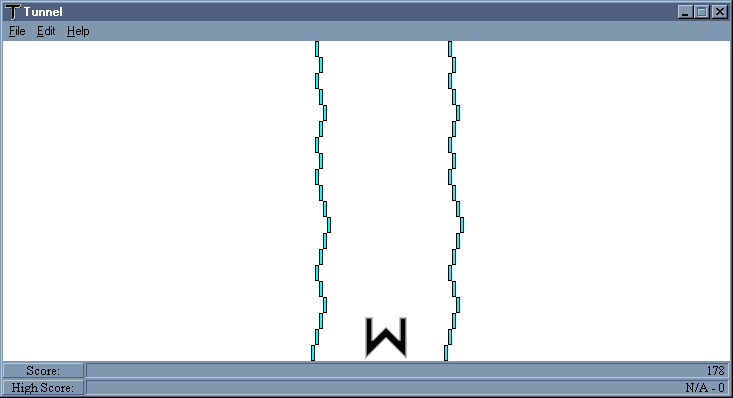



## Tunnel

### Description

This program is based on a calculator game that involves you controlling a ship's movements as you speed through an ever-shrinking tunnel. You can change the color of the tunnel walls and choose any of seven ships to use. Tunnel was made without the use of any API commands.
 
### More Info
 

             |
---                |---
**Submitted On**   |2000-10-22 15:36:58
**By**             |[Anton Venema](https://github.com/Planet-Source-Code/PSCIndex/blob/master/ByAuthor/anton-venema.md)
**Level**          |Intermediate
**User Rating**    |4.7 (14 globes from 3 users)
**Compatibility**  |VB 5\.0, VB 6\.0
**Category**       |[Complete Applications](https://github.com/Planet-Source-Code/PSCIndex/blob/master/ByCategory/complete-applications__1-27.md)
**World**          |[Visual Basic](https://github.com/Planet-Source-Code/PSCIndex/blob/master/ByWorld/visual-basic.md)
**Archive File**   |[CODE\_UPLOAD1087510222000\.zip](https://github.com/Planet-Source-Code/anton-venema-tunnel__1-12231/archive/master.zip)

